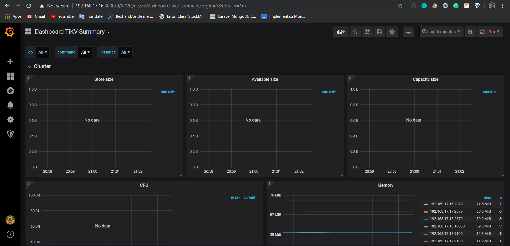

# EAS Basis Data Terdistribusi

# Tugas
- [Implementasi Arsitektur Sistem BDT](#Implementasi-Arsitektur)
  - [Desain Arsitektur](#Desain-Arsitektur)
  - [Detail Arsitektur](#Detail-Arsitektur)
  - [Langkah-langkah Implementasi](#Langkah-langkah-Implementasi)
  - [File-file yang dibutuhkan](#File-file-yang-dibutuhkan)
- [Pemanfaatan BDT dalam Aplikasi](#Pemanfaatan-BDT-dalam-Aplikasi)
  - [Deskripsi Aplikasi](#Deskripsi-Aplikasi)
  - [Setting Aplikasi](#Setting-Aplikasi)
  - [Operasi Create](#Operasi-Create)
  - [Operasi Read](#Operasi-Read)
  - [Operasi Update](#Operasi-Update)
  - [Operasi Delete](#Operasi-Delete)
- [Uji Performa](#Uji-Performa-Aplikasi-dan-Basis-Data)
  - [JMeter](#Uji-Performa-Aplikasi-dengan-JMeter)
  - [Sysbench](#Uji-Performa-Basis-Data-dengan-Sysbench.)
  - [Fail Over](#Uji-coba-Fail-Over)
- [Monitoring Dashboard](#Monitoring-Dashboard)


# Implementasi Arsitektur
## Desain Arsitektur

## Detail Arsitektur
  - Node 1
    - IP : 192.168.17.16
    - OS : geerlingguy/CentOS7
    - Memory : 512 mb
  - Node 2
    - IP : 192.168.17.17
    - OS : geerlingguy/CentOS7
    - Memory : 512 mb
  - Node 3
    - IP : 192.168.17.18
    - OS : geerlingguy/CentOS7
    - Memory : 512 mb
  - Node 4
    - IP : 192.168.17.19
    - OS : geerlingguy/CentOS7
    - Memory : 512 mb
  - Node 5
    - IP : 192.168.17.20
    - OS : geerlingguy/CentOS7
    - Memory : 512 mb
  - Node 6
    - IP : 192.168.17.21
    - OS : geerlingguy/CentOS7
    - Memory : 512 mb

## File-file yang dibutuhkan

  - vagrantfile

  ```ruby
    # -*- mode: ruby -*-
    # vi: set ft=ruby :

    Vagrant.configure("2") do |config|
    (1..6).each do |i|
        config.vm.define "node#{i}" do |node|
        node.vm.hostname = "node#{i}"

        # Gunakan CentOS 7 dari geerlingguy yang sudah dilengkapi VirtualBox Guest Addition
        node.vm.box = "geerlingguy/centos7"
        node.vm.box_version = "1.2.19"
        
        # Disable checking VirtualBox Guest Addition agar tidak compile ulang setiap restart
        node.vbguest.auto_update = false
        
        node.vm.network "private_network", ip: "192.168.17.#{15+i}"
        
        node.vm.provider "virtualbox" do |vb|
            vb.name = "node#{i}"
            vb.gui = false
            vb.memory = "512"
        end

        node.vm.provision "shell", path: "provision/bootstrap.sh", privileged: false
        end
    end
    end
  
  ```
  - bootstrap(dot)sh
  ```bash
    # Referensi:
    # https://pingcap.com/docs/stable/how-to/deploy/from-tarball/testing-environment/

    # Update the repositories
    # sudo yum update -y

    # Copy open files limit configuration
    sudo cp /vagrant/config/tidb.conf /etc/security/limits.d/

    # Enable max open file
    sudo sysctl -w fs.file-max=1000000

    # Copy atau download TiDB binary dari http://download.pingcap.org/tidb-v3.0-linux-amd64.tar.gz
    cp /vagrant/installer/tidb-v3.0-linux-amd64.tar.gz .

    # Extract TiDB binary
    tar -xzf tidb-v3.0-linux-amd64.tar.gz

    # Install MariaDB to get MySQL client
    sudo yum -y install mariadb

    # Install Git
    sudo yum -y install git

    # Install nano text editor
    sudo yum -y install nano

    # Install node exporter
    wget https://github.com/prometheus/node_exporter/releases/download/v0.18.1/node_exporter-0.18.1.linux-amd64.tar.gz
    tar -xzf node_exporter-0.18.1.linux-amd64.tar.gz
  ```
  - tidb(dot)conf
  ```
    vagrant        soft        nofile        1000000
    vagrant        hard        nofile        1000000
  ```
## Langkah-langkah Implementasi
### Menggunakan Vagrant
  1. Buat vagrantfile
  ```
  vagrant init
  ```
  2. Instalasi plugin yang dibutuhkan
  ```
  vagrant plugin install vagrant-vbguest
  ```
  3. Salin script vagrantfile di atas ke vagrantfile baru
  4. Jalankan vagrant
  ```
  vagrant up
  ```
  
  5. Setting TiDB
  - SSH ke dalam masing-masing node terlebih dahulu (buka di 6 terminal)
  ```
  vagrant ssh node1
  ```
  ...
  ```
  vagrant ssh node6

  ```
  #### Jalankan pada PD Server
  Pada node1
  ```
  cd tidb-v3.0-linux-amd64
  ```
  ```
  ./bin/pd-server --name=pd1 \
                  --data-dir=pd \
                  --client-urls="http://192.168.17.16:2379" \
                  --peer-urls="http://192.168.17.16:2380" \
                  --initial-cluster="pd1=http:/  192.168.17.16:2380,pd2=http:/  192.168.17.17:2380,pd3=http:/  192.168.17.18:2380" \
                  --log-file=pd.log &
  ```
  Pada node2
  ```
  cd tidb-v3.0-linux-amd64
  ```
  ```
  ./bin/pd-server --name=pd2 \
                  --data-dir=pd \
                  --client-urls="http://192.168.17.17:2379" \
                  --peer-urls="http://192.168.17.17:2380" \
                  --initial-cluster="pd1=http://  192.168.17.16:2380,pd2=http://  192.168.17.17:2380,pd3=http://  192.168.17.18:2380" \
                  --log-file=pd.log &
  ```
  Pada node3
  ```
  cd tidb-v3.0-linux-amd64
  ```
  ```
  ./bin/pd-server --name=pd3 \
                  --data-dir=pd \
                  --client-urls="http://192.168.17.18:2379" \
                  --peer-urls="http://192.168.17.18:2380" \
                  --initial-cluster="pd1=http://  192.168.17.16:2380,pd2=http://  192.168.17.17:2380,pd3=http://  192.168.17.18:2380" \
                  --log-file=pd.log &
  ```
  #### Jalankan pada Tikv Server
  Pada node4
  ```
  cd tidb-v3.0-linux-amd64
  ```
  ```
  ./bin/tikv-server --pd="192.168.17.16:2379,192.168.17.17:2379,  192.168.17.18:2379" \
                  --addr="192.168.17.19:20160" \
                  --data-dir=tikv \
                  --log-file=tikv.log &
  ```
  Pada node5
  ```
  cd tidb-v3.0-linux-amd64
  ```
  ```
  ./bin/tikv-server --pd="192.168.17.16:2379,192.168.17.17:2379,  192.168.17.18:2379" \
                  --addr="192.168.17.20:20160" \
                  --data-dir=tikv \
                  --log-file=tikv.log &
  ```
  Pada node6
  ```
  cd tidb-v3.0-linux-amd64
  ```
  ```
  ./bin/tikv-server --pd="192.168.17.16:2379,192.168.17.17:2379,  192.168.17.18:2379" \
                  --addr="192.168.17.21:20160" \
                  --data-dir=tikv \
                  --log-file=tikv.log &
  ```
  #### Jalankan pada TiDB Server
  Pada node1
  ```
  cd tidb-v3.0-linux-amd64
  ```
  ```
  ./bin/tidb-server --store=tikv \
                  --path="192.168.17.16:2379" \
                  --log-file=tidb.log &
  ```
# Pemanfaatan BDT dalam Aplikasi
## Deskripsi Aplikasi

trust(dot)me adalah aplikasi sederhana yang menjawab masalah orang yang tinggal di asrama ITS yang tidak mempunyai transportasi ataupun yang malas untuk pergi ke suatu tempat. trust(dot)me menyediakan platform untuk orang yang mau pergi ke suatu tempat untuk melakukan postingan di website terlebih dahulu, dengan mencantumkan waktu keberangkatan dan tujuan. Kemudian bagi orang yang ingin titip sesuatu tinggal memilih yang tujuannya sesuai.
## Setting Aplikasi
Perlu untuk mengubah .env nya
```
DB_CONNECTION=mysql
DB_HOST=192.168.17.16
DB_PORT=4000
DB_DATABASE=trustmedb
DB_USERNAME=root
DB_PASSWORD=
```
Hostnya disesuaikan dengan IP node1, dan portnya disesuaikan dengan setting (4000)
## Operasi Create
Mengambil kasus membuat keberangkatan

## Operasi Read
Mengambil kasus membaca semua keberangkatan

## Operasi Update
Mengambil kasus mengedit keberangkatan

## Operasi Delete
Mengambil kasus menghapus transaksi yang telah selesai


# Uji Performa Aplikasi dan Basis Data
## Uji Performa Aplikasi dengan JMeter
  - 100 Koneksi
  
  - 500 Koneksi
  
  - 1000 Koneksi
  
  Bisa dilihat bahwa average waktu semakin menurun seiring bertambahnya jumlah request
## Uji Performa Basis Data dengan Sysbench
  - 3 PD Server
  ```log
  SQL statistics:
      queries performed:
          read:                            2901171
          write:                           0
          other:                           0
          total:                           2901171
      transactions:                        2901171 (9669.68 per sec.)
      queries:                             2901171 (9669.68 per sec.)
      ignored errors:                      0      (0.00 per sec.)
      reconnects:                          0      (0.00 per sec.)

  General statistics:
      total time:                          300.0262s
      total number of events:              2901171

  Latency (ms):
          min:                                    0.53
          avg:                                   10.34
          max:                                  111.40
          95th percentile:                       18.95
          sum:                             29994913.42

  Threads fairness:
      events (avg/stddev):           29011.7100/59.25
      execution time (avg/stddev):   299.9491/0.02
  ```
  - 2 PD Server
  ```log
  SQL statistics:
      queries performed:
          read:                            2749118
          write:                           0
          other:                           0
          total:                           2749118
      transactions:                        2749118 (9162.79 per sec.)
      queries:                             2749118 (9162.79 per sec.)
      ignored errors:                      0      (0.00 per sec.)
      reconnects:                          0      (0.00 per sec.)

  General statistics:
      total time:                          300.0292s
      total number of events:              2749118

  Latency (ms):
          min:                                    0.52
          avg:                                   10.91
          max:                                  196.93
          95th percentile:                       20.37
          sum:                             29995466.40

  Threads fairness:
      events (avg/stddev):           27491.1800/64.55
      execution time (avg/stddev):   299.9547/0.01
  ```
  - 1 PD Server
  ```log
  SQL statistics:
      queries performed:
          read:                            2708965
          write:                           0
          other:                           0
          total:                           2708965
      transactions:                        2708965 (9029.08 per sec.)
      queries:                             2708965 (9029.08 per sec.)
      ignored errors:                      0      (0.00 per sec.)
      reconnects:                          0      (0.00 per sec.)

  General statistics:
      total time:                          300.0253s
      total number of events:              2708965

  Latency (ms):
          min:                                    0.60
          avg:                                   11.07
          max:                                  106.31
          95th percentile:                       21.11
          sum:                             29996120.31

  Threads fairness:
      events (avg/stddev):           27089.6500/47.76
      execution time (avg/stddev):   299.9612/0.01
  ```
  Bisa dilihat bahwa performa semakin meningkat seiring dengan meningkatnya jumlah PD (walau tidak signifikan)
  ## Uji coba Fail Over
  ### Langkah-langkah
  1. Buka url berikut pada browser
  ```
  http://192.168.17.16:2379/pd/api/v1/members
  ```
  2. Cek Leader
  
  3. Matikan salah satu PD Server dengan perintah
  ```
  sudo kill -9 <ID Proses>
  ```
  4. Pastikan sudah tidak ada proses
  ```
  ps aux | grep pd
  ```
  
  Proses mematikan PD dan pergantian leader  
  5. Cek Leader lagi
  
  Bisa dilihat bahwa Leader sudah berganti dari pd1 ke pd2
# Monitoring Dashboard
## Langkah-langkah
#### Pada semua node(node1 sampai node6)
1. SSH, kemudian jalankan perintah
```
cd node_exporter-0.18.1.linux-amd64
```
```
./node_exporter --web.listen-address=":9100" \
    --log.level="info" &
```
#### Pada node1
2. Lakukan instalasi prometheus dan grafana
```
cp /vagrant/installer/prometheus-2.2.1.linux-amd64.tar.gz .
```
```
tar -xzf prometheus-2.2.1.linux-amd64.tar.gz
```
```
cp /vagrant/installer/grafana-6.5.1.linux-amd64.tar.gz .
```
```
tar -zxf grafana-6.5.1.linux-amd64.tar.gz
```
3. Salin setting prometheus
```
cp /vagrant/config/prometheus.yml prometheus-2.2.1.linux-amd64/
```
isi file
```yml
global:
  scrape_interval:     15s  # By default, scrape targets every 15 seconds.
  evaluation_interval: 15s  # By default, scrape targets every 15 seconds.
  # scrape_timeout is set to the global default value (10s).
  external_labels:
    cluster: 'test-cluster'
    monitor: "prometheus"

scrape_configs:
  - job_name: 'overwritten-nodes'
    honor_labels: true  # Do not overwrite job & instance labels.
    static_configs:
    - targets:
      - '192.168.17.16:9100'
      - '192.168.17.17:9100'
      - '192.168.17.18:9100'
      - '192.168.17.19:9100'
      - '192.168.17.20:9100'
      - '192.168.17.21:9100'

  - job_name: 'tidb'
    honor_labels: true  # Do not overwrite job & instance labels.
    static_configs:
    - targets:
      - '192.168.17.16:10080'

  - job_name: 'pd'
    honor_labels: true  # Do not overwrite job & instance labels.
    static_configs:
    - targets:
      - '192.168.17.16:2379'
      - '192.168.17.17:2379'
      - '192.168.17.18:2379'

  - job_name: 'tikv'
    honor_labels: true  # Do not overwrite job & instance labels.
    static_configs:
    - targets:
      - '192.168.17.19:20180'
      - '192.168.17.20:20180'
      - '192.168.17.21:20180'
```
4. Jalankan prometheus dengan perintah
```bash
./prometheus \
    --config.file="./prometheus.yml" \
    --web.listen-address=":9090" \
    --web.external-url="http://192.168.16.33:9090/" \
    --web.enable-admin-api \
    --log.level="info" \
    --storage.tsdb.path="./data.metrics" \
    --storage.tsdb.retention="15d" &
```
5. Salin setting grafana
```
cp /vagrant/config/grafana.ini grafana-6.5.1/conf/
```
```ini
[paths]
data = ./data
logs = ./data/log
plugins = ./data/plugins
[server]
http_port = 3000
domain = 192.168.17.16
[database]
[session]
[analytics]
check_for_updates = true
[security]
admin_user = admin
admin_password = admin
[snapshots]
[users]
[auth.anonymous]
[auth.basic]
[auth.ldap]
[smtp]
[emails]
[log]
mode = file
[log.console]
[log.file]
level = info
format = text
[log.syslog]
[event_publisher]
[dashboards.json]
enabled = false
path = ./data/dashboards
[metrics]
[grafana_net]
url = https://grafana.net
```
6. Jalankan Grafana dengan perintah
```
./bin/grafana-server \
    --config="./conf/grafana.ini" &
```
7. Masuk Dashboard Grafana
- Masuk ke dalam dashboard grafana dengan cara buka alamat IP node1 di browser pada port 3000 (192.168.17.16:3000)
- Masukkan username dan password (admin admin)

8. Import Dashboard Grafana
- Buat Data Source baru terlebih dahulu

- Import Dashboard sesuai kebutuhan, link dashboard bisa diakses di [sini](https://github.com/pingcap/tidb-ansible/tree/master/scripts) 
9. Hasil keluaran Dashboard Grafana
Dashboard PD

Dashboard TiDB

Dashboard TiDB Summary

Dashboard TiKV Details

Dashboard TiKV Summary

